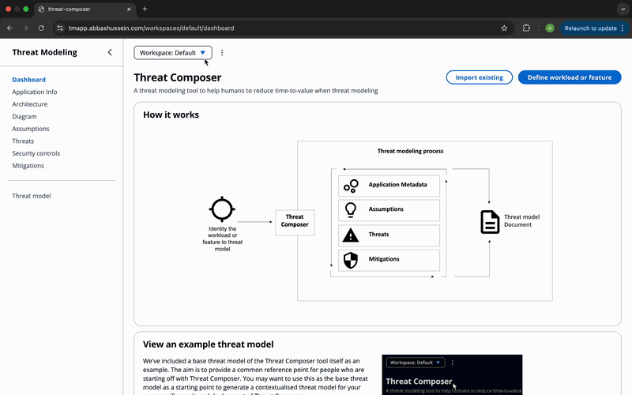

# Containerised Threat Modeling Tool App on AWS

<p align="center">
  
</p>

---

## Tools & Technologies

[](https://aws.amazon.com/ecs/)  
[](https://www.terraform.io/)  
[](https://www.docker.com/)  
[](https://github.com/features/actions)  
[](https://github.com/aquasecurity/trivy)  
[](https://www.checkov.io/)

---

## Project Overview

 This project delivers a fully automated, infrastructure-as-code pipeline for deploying a containerized threat-modeling application to AWS ECS Fargate. 
 
 Infrastructure as Code All AWS resources (ECS cluster, Fargate tasks, networking, IAM roles, etc.) are defined in Terraform, ensuring repeatable, version-controlled provisioning. 
 
 CI/CD Automation GitHub Actions handle the end-to-end workflow: building your Docker image, running tests, applying Terraform changes, and rolling out updates to Fargate—no manual AWS Console steps required.


## Project Structure
```
./
├── app/
├── Dockerfile
├── terraform/
│ ├── main.tf
│ ├── provider.tf
│ ├── variables.tf
│ └── modules/
│      ├── alb/
│      ├── ecs/
│      ├── iam/
│      ├── route53/
│      ├── networking/
│      ├──vpc/
|      |__sgs/
|      |__s3/
|      |__acm
├── .github/
│     └── workflows/
│            ├── build.yml
│            ├── terraformapply.yml
│            ├── terraformdestroy.yml
│            |__ terraformplan.yml
├── media/
│ ├── demo.gif
│ ├── demo.mov
│ └── palette.png
├── .gitignore
├── .terraform.lock.hcl
└── README.md

## Features 

Scalability:
Application deployed on AWS ECS with Fargate, enabling automatic scaling and ensuring high availability.

Security:
Container images scanned with Trivy to detect and address vulnerabilities.
Infrastructure tested with Checkov to verify compliance with security and best-practice guidelines.

Production-Readiness:
HTTPS enabled for secure communication.
Robust, fault-tolerant infrastructure designed for reliability.

CI/CD Pipeline:
Fully automated deployment pipeline for efficient integration and continuous delivery.

Modular Terraform:
Infrastructure as Code implemented with modularised Terraform for clean, reusable, and maintainable configuration.

Multi-Stage Docker Builds:
Optimised and lightweight container images created via multi-stage builds.


## Local Development

### 1. Clone the Repository
Get a copy of the project and move into its directory:
```bash
git clone https://github.com/AbbasHusseinOps/ThreatModel-app
cd [repo-directory]

Run Locally 

yarn install
yarn build
yarn start

Once running, open your browser and go to http://localhost:3000.